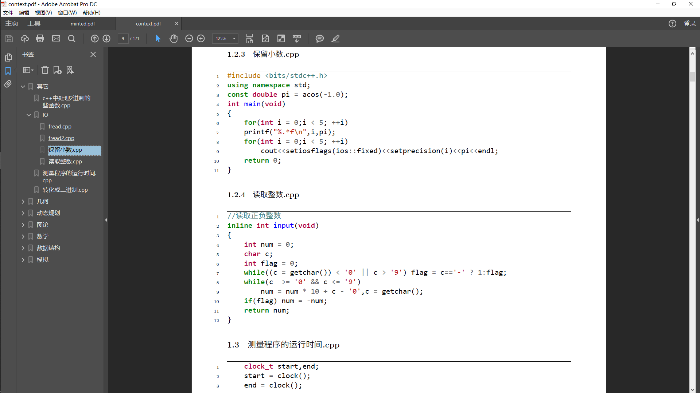
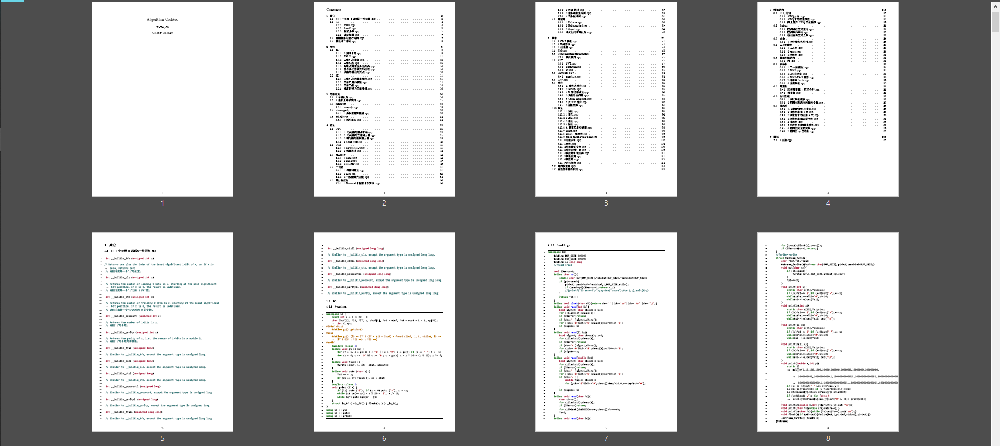

# 代码书生成器（CodeFilesToPDF）

## 背景

在赛前整理模板的时候，我常常会有这样的不便————我需要打包的代码文件太多了！
当然也不乏许多巨巨伙伴平时就有良好习惯，自己的模板都已经整理成md文件了。
但是我认为这其中还是有缺陷的：

- 如果单个md文件太长，就不便于修订和整理。

- 如果md文件较短但是太多，就不便于最后整合pdf打印。

我想到两种解决方案：

借助批处理脚本，把目录里所有md文件内容顺次拼接（我没有去实现，但感觉比这个项目更简单，也更可行）。而这样的前提是平时就有良好习惯，把自己代码整理在md文件里。（而我没有）其次有个麻烦的地方是对于大型md文件转pdf的时候，怎么解决目录与页码的问题？在这里点上我没有深入研究，感觉也没有头绪。
  
由于我的习惯是存代码文件，必要的时候写一些注释，所以我的实际需要一个把大量代码整理成一本书，并且有简单标题和页码索引的。于是LaTeX走进了是我的选择范围，因为tex本身有很多宏包能实现优雅的印刷结构，还可以借助minted宏包通过路径来引入代码文件输出代码片，甚至还能高亮（绝了）。那么我只要用一个程序来构造带有一大堆路径的tex文件就够了。

## 原理

运行build.exe遍历所有目录，把代码文件的路径拼接，构造tex文件。
至于tex文件如何编译产出pdf，可能会有很多不同方案与做法，我使用的是XeLaTeX。

## 环境

- win10（2019中旬之后的版本）

- python 3.7.2 (必须)

- TexLive 2019 （用于生成pdf）

- VS Code LaTeX Workshop （编辑工具）

我写了下面两篇拙记，解释了我是如何开始的。

[Latex 傻瓜式入门](https://www.cnblogs.com/tieway59/p/11123628.html)

[LaTeX 傻瓜式起步](https://www.cnblogs.com/tieway59/p/11125628.html)

## 使用

1. 把你所有需要的代码都丢到templates文件夹里。
2. 运行build.exe。
3. 自己想办法编译：\buildUtils\LaTeX\context.tex
4. context.pdf 就是结果了。

## 优点

- win10可用。
- 方便修订和改目录。
- 减少排版和复制粘贴的压力。
- 文件目录即是内容目录。
- 支持关联部分扩展名的代码程序，如果需要可以在build里再加兼容。

## 缺陷

- [硬伤] 标题只能分到LaTeX默认的三级。
- [硬伤] 如果代码文件保存时的编码和当前系统编码不同，中文会乱码。
- [硬伤] 如果系统语言编码不是中文，会独取异常。
- [潜在] 一些奇怪的路径可能导致出错。
- [潜在] 一些长压行的代码会折行异常。（模板代码干嘛压行啊喂ORZ）
- [玄学] 编译成功的要求蛮高的，少不了折腾。

## 鸣谢

[**ACM-template**](https://github.com/Strive-for-excellence/ACM-template) 本项目之前测试用的模板来自于这位朋友的公开仓库，也是因为他的模板我win上面运行不了，所以才有了我这个项目。特别感谢他的开源精神。@Strive-for-excellence

[**C++遍历目录和文件夹**](https://www.cnblogs.com/tinaluo/p/6824674.html) 我的build.cpp的代码主要学习了这篇博客的写法，我觉得自己有必要重新写一下。

## 待办

- [ ] 重构build.cpp 参考[win10 下 c++遍历文件夹](https://blog.csdn.net/ming5945/article/details/78594864)
- [x] 修掉laxer导致的red box [minted
 issue #243](https://github.com/gpoore/minted/issues/243)
- [ ] 增加引入md的feature
