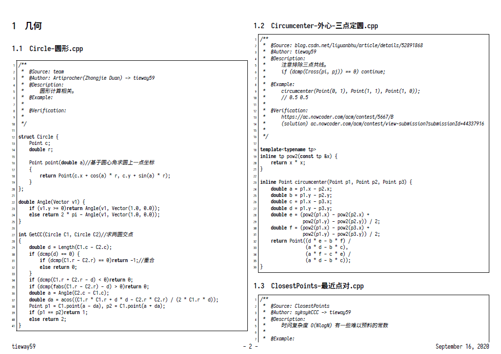
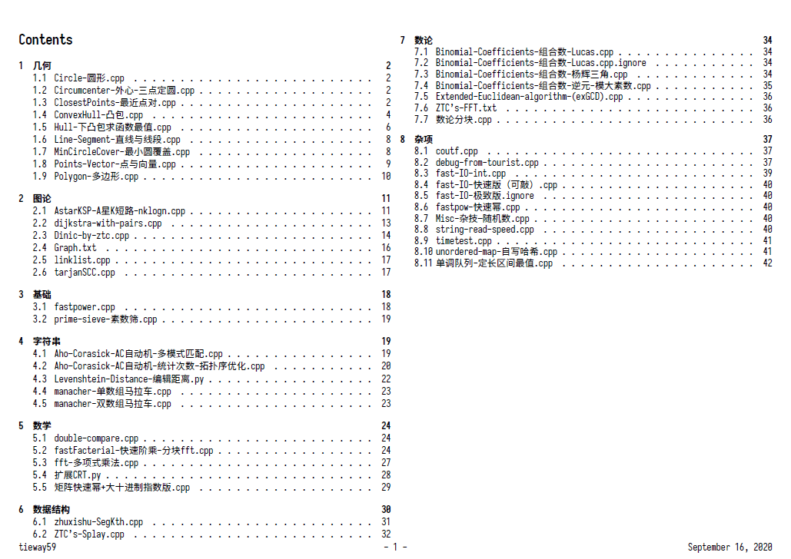
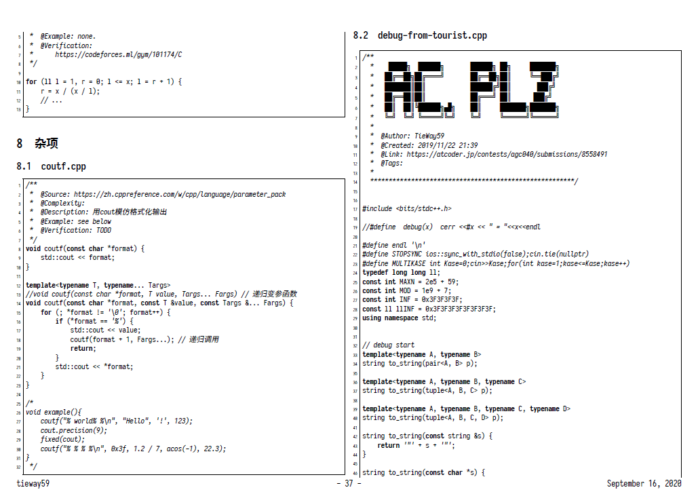
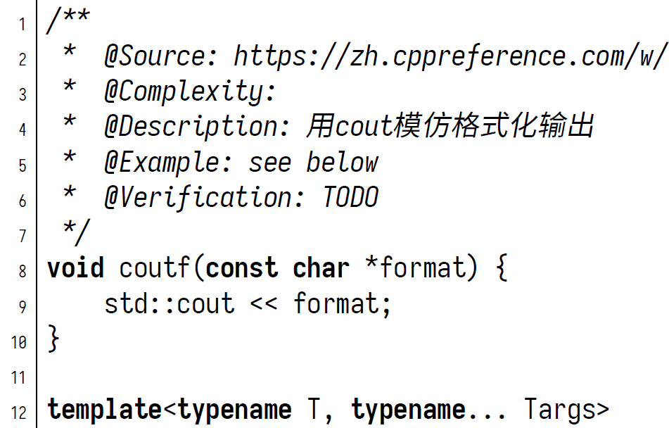
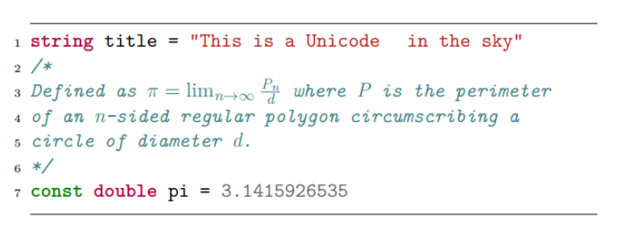
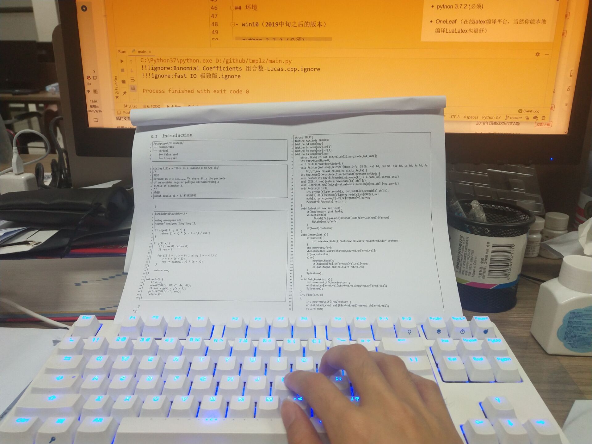

# 代码书生成器（CodeFilesToPDF）

## 一个很合理的背景

参加算法竞赛可以带纸质参考材料，所以每次赛前准备材料的打印是一个很头疼的问题。

当然也不乏许多大佬平时就有良好习惯，自己的模板都已经整理成md文件了。

但是我认为这其中还是有缺陷的：

- 如果单个md文件太长，就不便于修订和整理。（而且容易卡顿）

- 如果md文件较短但是太多，就不便于最后整合pdf打印。

## 一个冒失但可行的方案

我们知道Latex是是很好的编书工具。

Latex的minted包有不错的代码排版效果。

并且支持外部文件通过url导入，这部分代码非常程序化。

那么只要有一个把文件夹结构翻译成tex的语句就好。

在分支中有一个我去年做过的C++的尝试[link](https://github.com/TieWay59/tmplz/tree/v0.1.0-archived)

今年我想用python做一遍，并且在样式上有更多改进创新。

## 特性展示

优雅的 [sarasa](https://github.com/be5invis/Sarasa-Gothic) 字体，保持简中和代码都良好等宽：

神奇的 mathescape 让你的注释可以添加公式（语法同markdown $）：

即使没有队友也能方便地对着文本敲:

## 环境

- win10（2019中旬之后的版本）

- python 3.7.2 (必须)

- OneLeaf （在线latex编译平台，当然你能本地编译LuaLatex也很好）

## 使用

1. 把模板文件夹放入`codefiles`路径下。
2. 编译运行main.py
3. 编译`latexbuild`中的`main.tex`文件。（建议上传OneLeaf，在线Lua编译）

## 优点

- 尽量保证代码一行完整
- 非常省纸
- 方便修订和改目录
- 减少排版和复制粘贴
- 文件目录即是内容目录
- 支持关联部分扩展名的代码程序，main.cpp
- python代码非常容易根据需求定制

## 缺陷

- 标题只能分到LaTeX article类的四级，过多的层级都会被认为是`subsubsection`。
- 一些过度压行的代码会折行异常。（点名批评压行选手）

## 待办

- [x] 优化chapter标题导致的过度分页
- [ ] 增加引入md的feature 
    - 困难太大，不想搞了。
